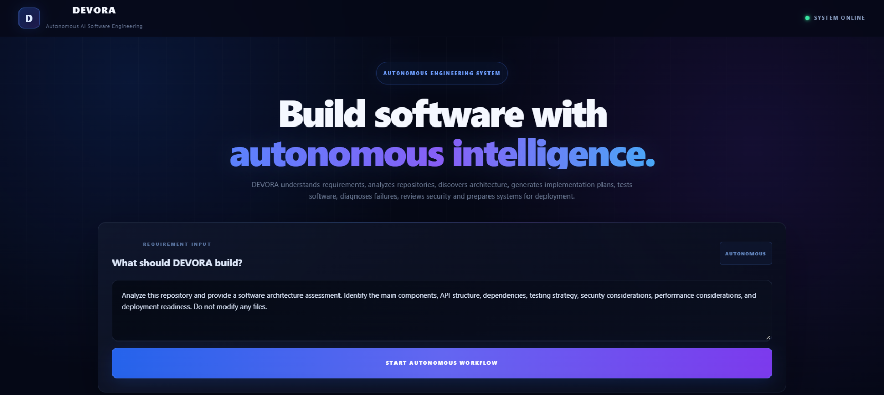

# DEVORA

<p align="center">
  <strong>Autonomous AI Software Engineering</strong><br />
  Turn a software requirement into an AI-assisted engineering workflow.
</p>

<p align="center">
  <a href="https://github.com/Nikhildusa07/DEVORA/actions/workflows/devora.yml">
    
  </a>
  
  
  
</p>

DEVORA combines a React dashboard with a FastAPI service layer for AI-assisted software engineering. Its autonomous workflow coordinates requirement analysis, repository and architecture discovery, implementation planning, testing, review, security and performance analysis, and deployment readiness.

> **Project status:** The repository contains a functional frontend and a broad set of backend API/service modules. The autonomous workflow requires a Gemini API key and access to the repository path supplied to the backend. Review the [integration notes](#frontendbackend-integration) and [operational considerations](#operational-considerations) before using it on a real project.

## Contents

- [Dashboard](#dashboard)
- [Capabilities](#capabilities)
- [Architecture](#architecture)
- [Technology](#technology)
- [Getting started](#getting-started)
- [Configuration](#configuration)
- [Frontend/backend integration](#frontendbackend-integration)
- [API overview](#api-overview)
- [Testing and CI](#testing-and-ci)
- [Operational considerations](#operational-considerations)
- [Contributing](#contributing)
- [License](#license)

## Dashboard

The dashboard accepts a requirement, starts the autonomous workflow, and displays the progress/result areas exposed by the backend.



## Capabilities

The backend exposes individual endpoints as well as an orchestration endpoint. Implemented service areas include:

| Area | Examples |
| --- | --- |
| AI and requirements | AI reasoning, requirement analysis, implementation generation |
| Repository and design | Repository analysis, architecture discovery and planning, dependency analysis |
| Code lifecycle | Code generation and modification, refactoring, debugging, automated fixes |
| Quality | Test generation and execution, code review, security and performance analysis |
| Delivery and operations | Deployment checks and execution, CI/CD analysis, monitoring, regression analysis, rollback |
| Collaboration | Git status, branches and commits, pull-request operations, repository memory |
| Attendance | Create and query attendance records backed by SQLite |

The autonomous workflow is orchestrated by `AutonomousWorkflowService`; its visible dashboard summarizes testing, review, security, performance, deployment, monitoring, and regression statuses.

## Architecture

```text
DEVORA/
├── backend/
│   ├── main.py                 # FastAPI application and router registration
│   ├── app/
│   │   ├── api/                # HTTP routes
│   │   ├── services/           # Workflow and feature services
│   │   ├── models/             # SQLAlchemy models
│   │   ├── schemas/            # Request/response schemas
│   │   └── database.py         # SQLite engine and session dependency
│   ├── tests/                  # Backend pytest tests
│   └── requirements.txt
├── frontend/
│   ├── src/
│   │   ├── App.jsx             # Dashboard and workflow request
│   │   └── assets/
│   ├── package.json
│   └── vite.config.js
├── docs/images/                # Documentation screenshots
└── .github/workflows/          # GitHub Actions workflow
```

The frontend is a single-page React application. The backend registers feature routers on a FastAPI app, initializes SQLAlchemy tables during application startup, and persists attendance data in SQLite (`backend/devora.db` when run from `backend/`).

## Technology

- **Frontend:** React 19, Vite 8, JavaScript, ESLint
- **Backend:** Python, FastAPI, Pydantic, SQLAlchemy, Uvicorn
- **AI:** Google Gemini via the `google-genai` Python package
- **Persistence:** SQLite
- **Backend tests:** pytest and FastAPI `TestClient`
- **Automation:** GitHub Actions (backend test workflow)

## Getting started

### Prerequisites

- Python 3.11 or newer
- Node.js and npm
- A Gemini API key for AI reasoning and implementation features

### 1. Configure the backend

From the repository root, create and activate a virtual environment:

```powershell
cd backend
py -3.11 -m venv .venv
.\.venv\Scripts\Activate.ps1
python -m pip install -r requirements.txt
```

Set the Gemini key in the current PowerShell session:

```powershell
$env:GEMINI_API_KEY = "your-gemini-api-key"
```

Start the API from the `backend/` directory:

```powershell
python -m uvicorn main:app --reload
```

The API is then available at `http://127.0.0.1:8000`. FastAPI's interactive API explorer is at `http://127.0.0.1:8000/docs`, with the alternative ReDoc view at `http://127.0.0.1:8000/redoc`.

### 2. Start the frontend

In a second terminal, from the repository root:

```powershell
cd frontend
npm install
npm run dev
```

Open the local URL printed by Vite (normally `http://localhost:5173`).

> **Important:** Starting the local frontend does not currently connect it to the local API automatically. See [Frontend/backend integration](#frontendbackend-integration) before submitting a workflow request.

## Configuration

| Setting | Required for | Description |
| --- | --- | --- |
| `GEMINI_API_KEY` | AI reasoning and implementation | API credential read by the AI services. Supply it through the environment or a local, untracked `.env` file. Never commit credentials. |
| Repository path in the workflow request | Autonomous workflow | Absolute path to a repository that the backend process can access. |

The database URL is currently set in `backend/app/database.py` to `sqlite:///./devora.db`. It is a relative path, so the resulting database location depends on the backend process's working directory. The documented commands start the process from `backend/`.

## Frontend/backend integration

The workflow button in `frontend/src/App.jsx` currently posts to the hosted endpoint:

```text
https://devora-ah49.onrender.com/api/autonomous-workflow/autonomous/execute
```

It submits `repository_path`, `requirement`, and `code`. The current `repository_path` is an absolute Windows path from the original development environment, and the `code` value is a sample snippet. A remote backend cannot access a path on your own computer. For a local setup or another deployment, configure the frontend to call the intended backend and provide a repository path that is valid and accessible **to that backend process**. Do not expose a developer machine's filesystem or API credentials to an untrusted service.

## API overview

The backend health endpoints are:

| Method | Path | Purpose |
| --- | --- | --- |
| `GET` | `/` | Basic service identity and status |
| `GET` | `/health` | Health check |
| `POST` | `/api/autonomous-workflow/autonomous/execute` | Run the autonomous engineering workflow |
| `POST` | `/attendance/` | Record an attendance entry |
| `GET` | `/attendance/` | List attendance entries; optional `student_id` and `date` filters |
| `GET` | `/attendance/{attendance_id}` | Retrieve an attendance entry |

Other feature routes are registered in `backend/main.py`. Use `/docs` on a running backend for the authoritative, interactive list of paths, request schemas, and response schemas.

Example autonomous-workflow request:

```json
{
  "repository_path": "C:\\path\\to\\repository",
  "requirement": "Add a student attendance feature with API endpoints and database storage.",
  "code": "def example():\n    return True"
}
```

## Testing and CI

Run the backend tests from `backend/`:

```powershell
python -m pytest
```

The current GitHub Actions workflow installs `backend/requirements.txt` and runs pytest on pushes to `master` and `devora-feature`, and on pull requests targeting `master`. The frontend package defines `npm run lint` and `npm run build`; it does not currently define a frontend test script.

## Operational considerations

- Treat autonomous code modification, test execution, Git, deployment, and rollback features as potentially destructive. Use a disposable repository or isolated working tree until the exact workflow behavior is understood.
- The workflow's repository path must resolve on the backend host. Do not assume the backend can read files from the browser user's computer.
- The FastAPI app currently enables permissive CORS (`allow_origins=["*"]`) and does not show an authentication layer in its router setup. Restrict origins and secure filesystem-mutating endpoints before exposing the API to untrusted clients.
- Keep Gemini credentials in environment configuration, not source files, frontend bundles, or committed documentation.

## Contributing

1. Create a focused branch for your change.
2. Keep API, service, schema, and model changes aligned.
3. Add or update backend tests for behavior changes.
4. Run the relevant checks locally and describe their results in your pull request.

## License

No license file is currently present in this repository. Until a license is added, assume that reuse and redistribution are not granted.
